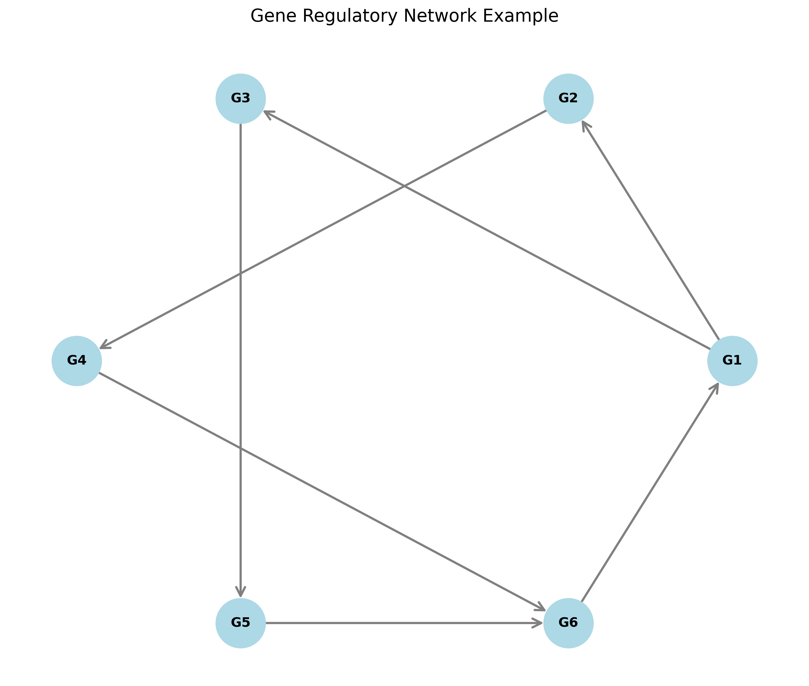

# Master's Thesis: Gene Regulatory Networks Driving Shape Homeostasis

## Project Overview

The main goal of the master thesis project is to expand the work made by Gerlee et al. (missing/fix reference). 
They implemented a computational model of developing cells on a grid.
Their aim was to study how different 
individual cellular characteristics drive the emergence of homeostatic structures. The model combines 
different sets of abilities for the cells such as: sense of orientation (polarization) and communication with 
surrounding neighbors via diffusible factors.

## Model Description

Each cell has four possible states, namely: **quiet**, **move**, **die**, **split**. The selection of a state is 
made by a neural network which takes input values from the grid/environment. The outputs of the neural network give the cells a state, the amount 
of chemicals they produce and an orientation in the grid. Every individual cell contains a neural network which is inherited by its mother 
cell, this is the cell genotype. To reach the expected solutions, i.e., the homeostatic structure, an 
evolutionary algorithm optimizes the neural network.

*The simulation environment shows cells in different states alongside SGF and LGF concentration patterns.*

## Implementation Features

### Core Components
- **Cellular Automata**: Spatial modeling of cell dynamics on a grid
- **Neural Networks**: Gene regulatory networks within each cell
- **Chemical Signaling**: SGF (Short-range Growth Factor) and LGF (Long-range Growth Factor)
- **Evolutionary Algorithms**: Genetic algorithm for network optimization

*Example of a gene regulatory network showing regulatory interactions and feedback loops.*

### Technical Improvements
- **Optimized algorithms** with improved performance
- **Relaxed model constraints** (grid borders, cell genotype)
- **Expanded solution space** for evolutionary algorithms
- **Interactive web interface** for real-time simulation control
- **Containerized deployment** for reproducible environments

*Typical fitness progression during genetic algorithm optimization.*

## Expected Results

The research aims to identify:
- **Minimal sets of characteristics** that lead to different cellular behavior
- **Distinct fitness functions** that favor specific physical shapes
- **Different models of cell dynamics**: sets of rules, dynamical systems
- **Emergent homeostasis mechanisms** in multicellular systems

## Software Implementation

The project includes:
- **Modular architecture** with clean separation of concerns
- **Interactive web interface** using Streamlit and Plotly
- **Containerized deployment** with Docker
- **Comprehensive documentation** and examples
- **Research tools** for analysis and evaluation 
